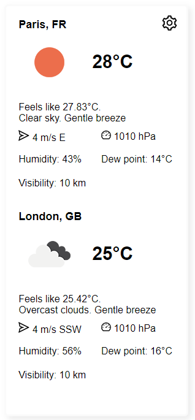
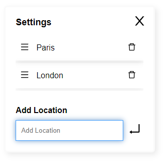

# Weather widget
Виджет для отображения погоды в выбранных городах.  
**Возможности**: 
- Добавление выбранного города по названию;
- Удаление города из списка;
- Изменение порядка отображения городов в настройках (путем перетаскивания элементов);
- Сохранение списка городов в localStorage;
- Определение локации

**Технологии**: Vue 3, Pinia, Typescript, SCSS.

## Скриншоты
|          |       |
|----------|---------|
| Weather City List | Settings |

## Использование
Виджет можно разместить на своем сайте, добавив в HTML файл следующий код:
```HTML
<weather-widget />
<script defer="defer" src="https://vadmitriev.github.io/weather-widget/index.js"></script>
```

Также можно указать интервал обновления погоды в минутах через свойство `timeout` (по умолчанию 30 минут):
```HTML
<weather-widget timeout="1" />
```

## Установка
```console
git clone https://github.com/vadmitriev/weather-widget
```

```console
cd weather-widget
```

```console
cp env.sample .env
```

В файле `.env` необходимо указать значение переменной `VUE_APP_WEATHER_API_KEY` как ключ к API сервиса погоды OpenWeatherMap.

```console
npm install
```

```console
npm run serve
```
